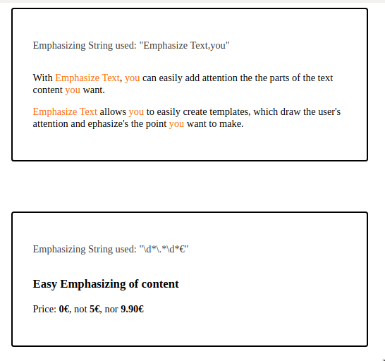

# Emphasize Text

[](https://badge.fury.io/js/emphasize-text)

Emphasize text is used for easy emphasizing of text content on web pages.

Emphasize text analyzes the text inside it, and finds the provided keywords / regex given and surrounds them with spans for
simple styling

Due to Emphasize Text using comma (,) as the seperator of the strings, comma itself cannot be highlighted.

### Install

```bash
npm install emphasize-text
```

### Usage

```js
import 'emphasize-text';
```

```html
<style>
    .orange-text {
        color: #ff6d00;
    }

    .emphasize {
        font-weight: bold;
    }
</style>
<div class="card">
    <emphasize-text emphasize="Emphasize Text,you" emphasizeclass="orange-text">
        <p>With Emphasize Text, you can easily add attention the the parts of the text content you want.</p>
        <p>
            Emphasize Text allows you to easily create templates, which draw the user's attention and ephasize's the
            point you want to make.
        </p>
    </emphasize-text>
</div>

<div class="card">
    <emphasize-text emphasize="\d*\.*\d*€">
        <h3>Easy Emphasizing of content</h3>
        <p>Price: 0€, not 5€, nor 9.90€</p>
    </emphasize-text>
</div>
```

Would result to



### Properties

| Name             | Usage                                                         | Examples                              |
| ---------------- | ------------------------------------------------------------- | ------------------------------------- |
| `emphasize`      | Comma seperated list of words/regexes you want to emphasize   |  `emphasize="me,you"`                 |
| `emphasizeClass` | Set custom class to emphasized elements for more unique usage | `emphasizeClass="my-emphasize-class"` |
